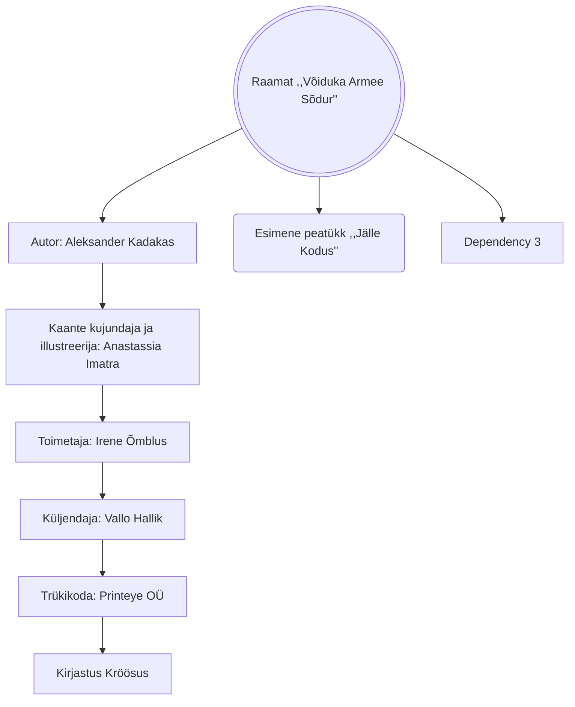

# Voiduka-Armee-Sodur
Võiduka Armee Sõdur - Raamatu dokumentatsioon paremini järje hoidmiseks.

```mermaid

mindmap
  root((Raamat ,,Võiduka Armee Sõdur''))
     ✩
      	Autor: Aleksander Kadakas
      	  Kaante kujundaja ja illustreerija: Anastassia Imatra
      	    Toimetaja: Irene Õmblus
      	      Küljendaja: Vallo Hallik
      	        Trükikoda: Printeye OÜ
      	          Kirjastus Kröösus


   		Chapters
   			Esimene peatükk ,,Jälle Kodus''
          	%%7
				    asukoht
					    tegelased
						    märksõnu
							    KOKKUVÕTE
   			  ,,Minek ehk esimene pulmaöö''
          	  %%10
				      asukoht
					        tegelased
						         märksõnu
							          KOKKUVÕTE
   		  	  ,,Sõjakool''
          	    %%21
				        asukoht
					          tegelased
						           märksõnu
							            KOKKUVÕTE
   		  	    ,,Esimene sõjasaladus''
          	      %%43
				          asukoht
					            tegelased
						             märksõnu
							              KOKKUVÕTE
   		  	      ,,Saadetis 200''
          	        %%48
				            asukoht
					              tegelased
						               märksõnu
							                KOKKUVÕTE
   		  	        ,,Tõelises lahingüksuses''
          	          %%67
				              asukoht
					                tegelased
						                 märksõnu
							                  KOKKUVÕTE
   		  	          ,,𝙏𝙚𝙞𝙣𝙚 𝙨õ𝙟𝙖𝙨𝙖𝙡𝙖𝙙𝙪𝙨''
          	            %%86
				                𝒜𝒮𝒰𝒦𝒪𝐻𝒯: Tuula väeosa
					                  𝒯𝐸𝒢𝐸𝐿𝒜𝒮𝐸𝒟: Seersant Toomas Linnupoeg, tol päeval komandopunkti korrapidaja olnud leitnant Mitrohhin, staabliülem major Miller, komandör alampolkovnik Obuhhov, nimetamata kapten kes esindab KGB-d lennuväelase vormis ja Linnupoja sõber vanemleitnant Sergei Filippov.
						                   °✷🎀  𝑀Ä𝑅𝒦𝒮Õ𝒩𝒰:  🎀✷° Kõrguse ja kauguse mõõtmine, fotoaparaat Zenit, KGB, must Volga, lennukid, MIG-25 uuendus, muie luuravast SR-71'st
							                    𝒦𝒪𝒦𝒦𝒰𝒱Õ𝒯𝐸: Ühel suvisel pühapäeval mängisid sõdurid jalgpalliväljakul, ning seda tegi ka Toomas, kuid pisut tahapoole hoides. Vähemalt seniks, kui tuli väljaku äärde päevnik, kes teatas et Linnupoeg peab suunduma angaari ja käivitama kõrgusemõõtmisseadme. Peale tööülesande täitmist ja komandopunkti info edastamist, otsustab Linnupoeg aja veetmiseks vajutada kõrgusemõõtjal nuppu, mis muudab ekraanil nähtava kõrguse kilometraaži. Järsku, vaikselt lokaatorit pöörates avastab Linnupoeg, et üks lennuk lendab tunduvalt kõrgemal tavalistest reisilennukitest. Muidugi annab Toomas sellest koheselt komandopunktile teada ja lülitab sisse fotokontrolli, kinnitamaks kahtlase lennuki olemasolu. Toomas arutab endamisi, et ameeriklaste superlennuk SR-71 lendab tema üllatuslennukiga enam-vähem samal kõrgusel /u. 35km/. Peale fotode ilmutamist ja pimiku lukustamist märkas Toomas peagi, et kugi on pühapäev, olid väeossa tulnud Miller ja Obuhhov. Ning mitte kaua peale seda, märkas ta ka seda, et värava juures on must Volga, millel väravavalve vägagi rutakalt sisse lasi tulla ning mille poole Miller ja Obuhhov koheselt suundusid. Autost tuli välja vanem kuid kapteni aukaardiga lennuväelase vormis sõjaväelane, kes näitas komandörile midagi enda kaustast, mille peale to Linnupoja kohale kutsus ja to tema käsutusse andis. Kapten soovis näha pimikus asuvate lennuki 0-11 fotosid näha, peagi aimas Toomas, et see on tema teine kohtumine KGB-ga. Antud lennukiga seotud intsident kuulutati riiklikuks saladuseks. Kapten ja ohvitserid lahkusid väeosast. Järgmisel päeval soovis Toomase sõber Sergei vaadata radariplokid üle ja aimates eelmisel päeval toimunud kokkupuute kohta, mainis ta et Toomasel igasuguseid mõtteid pähe ei tuleks, et ta tegelikkuses sai vist jaole hoopis MIG-25 uuendusele ja et selle lennulage tahetakse veel kümme kilomeetrit tõsta. Siis ei olegi enam võimalustki, et mingi SR-71 neil tagahoovis luurab! Selle peale tänas Toomas sõpra ja jäi mõtlema, et kui palju ta neid sõjasaladusi veel koju viib... 

   		  	            ,,Dissidentide väeosa''
          	              %%94
				                  𝒜𝒮𝒰𝒦𝒪𝐻𝒯: Tuula, Koptjevo küla, Orjoli linna Novogorka väeosa
					                    𝒯𝐸𝒢𝐸𝐿𝒜𝒮𝐸𝒟: Nooremseersandid Toomas Linnupoeg ja sõber Avetissov, napsune vene naine, komandör alampolkovnik Obuhhov, diisli-mees Miša, kaks grusiinlasesst radisti - Korkia ja Meladze, Vadim, Ramzan, jefreitor Zolotovitski
						                     °✷🎀  𝑀Ä𝑅𝒦𝒮Õ𝒩𝒰:  🎀✷° Diskod, roheline pulmabuss kleenukese mehe ja kobeda naisega, linnaluba, looduskaitse all olemise võlud ja raskused, ametikõrgendus, Gruusia pidu, Orjol, dissidentide väeosa, seadusega pahuksis
							                      𝒦𝒪𝒦𝒦𝒰𝒱Õ𝒯𝐸: Suvi näitas oma viimaseid päikeselisi hetki. Vili oli koristatud ja sügis oli lähenemas. Toomas kurdab sõjaväe elu üle ja saab koos Avetissoviga linnaloa, kuid satub tagasi väeossa hääletades pulmabussi, mis teeb kõrvalpõike. Peale rinnaka ja tugevalt samaka järgi lõhnava naise katsetust Toomast heinarõuku kutsuda, leiavad poisid, et nüüd on aeg pulmapeolt lahkuda. Tagasi väeossa jõudnud, kulges järgmise päeva pühapäevane hommik rahulikult, hommikuse rivisttuse lõpus andis Obuhhov korralduse Linnupojal rivi ette astuda ja kuulutas talle välja sõjalise auastme - seersant. Lisaks teatas Obuhhov, et homsest jätkab Toomas oma teenistust Orjoli linnas. See tuli Toomasele suureks üllatuseks, kuna ta pidi easialgu kuni teenistuse lõpuni siinsamas teenima. Obuhhov ütles hiljem saladuse katte all, et nad tegid mis nad said, kuid sellegi poolest tuli selleks käsk. Gruusia poisid koos sõpradega tegid Gruusia stiilis ärasaatmispeo, kus tamadaks oli muidugi Toomas. Järgmisel päeval põdesid poisid pohmakat ja mingil põhjusel oli Toomas sunnitud tund aega oodatust varem Orjolisse sõitma, niisiis ta ei saanudki kellegagi hüvasti jätta. Orjolis suubus ta Novogorka väeossa, kuhu ta oli määratud aastaks teenima. Esialgu tundus Toomasele, et tegemist on eliitväeosaga, tänu koha luksuslikusele /kinosaal, neljased toad koos reformvooditega, spordisaal, Lenini ruum, õunapuuaed, saun ringduši ja basseiniga jne/ kuid selgus, et tegemist on hoopis dissidentide väeosaga
   		  	              ,,Komandöriks noorsõduritele''
          	                %%117
				                    asukoht
					                      tegelased
						                       märksõnu
							                        KOKKUVÕTE
   		  	                ,,Gagarin''
          	                  %%139
				                      asukoht
					                        tegelased
						                         märksõnu
							                          KOKKUVÕTE
   		  	                  ,,Jalgpall versus Sergei Jessenin versus armeekindral''
          	                    %%150
				                        asukoht
					                          tegelased
						                           märksõnu
							                        KOKKUVÕTE
   		  	                    ,,Punane diplomaatiline kuller''
          	                      %%196
				                          asukoht
					                            tegelased
						                             märksõnu
							                          KOKKUVÕTE
   		  	                    	,,Viimane kohtumine KGB-ga''
          	                     	 %%196
				                          	asukoht
					                            	tegelased
						                             	märksõnu
							                          	KOKKUVÕTE
   		  	                    		,,Kolmas sõjasaladus''
          	                     	 	%%211
				                          		asukoht
					                            		tegelased
						                             		märksõnu
							                          		KOKKUVÕTE
   		  	                    			,,Põgenemine ehk ärgu olgu sul sada rubla, vaid sada sõpra''
          	                     	 		%%219
				                          			asukoht
					                            			tegelased
						                             			märksõnu
							                          			KOKKUVÕTE
   		  	                    				,,Lõppakord''
          	                     	 			%%233
				                          				asukoht
					                            				tegelased
						                             				märksõnu
							                          				KOKKUVÕTE



     ✩
      	Tegelaste kirjeldused
      	  leitnant Mitrohhin -  Kehakas, et mitte öelda paks noremapoolne ohvitser, kes alati hakkas hingeldama, kui pidi tegema üle kümne sammu või rääkima üle kahe lause. /lk 88/
      	    Toimetaja: Irene Õmblus
      	      Küljendaja: Vallo Hallik
      	        Trükikoda: Printeye OÜ
      	          Kirjastus Kröösus
```

	  

Kasutatud materjalid, tööriistad ja allikad:
- https://lingojam.com/BoldTextGenerator
- https://docs.github.com/en/get-started/writing-on-github/working-with-advanced-formatting/creating-diagrams#creating-mermaid-diagrams
- https://mermaid.js.org/syntax/mindmap.html

Lisaks asju mida huvi tõttu lugeda:
- https://github.github.com/gfm/#what-is-github-flavored-markdown-
