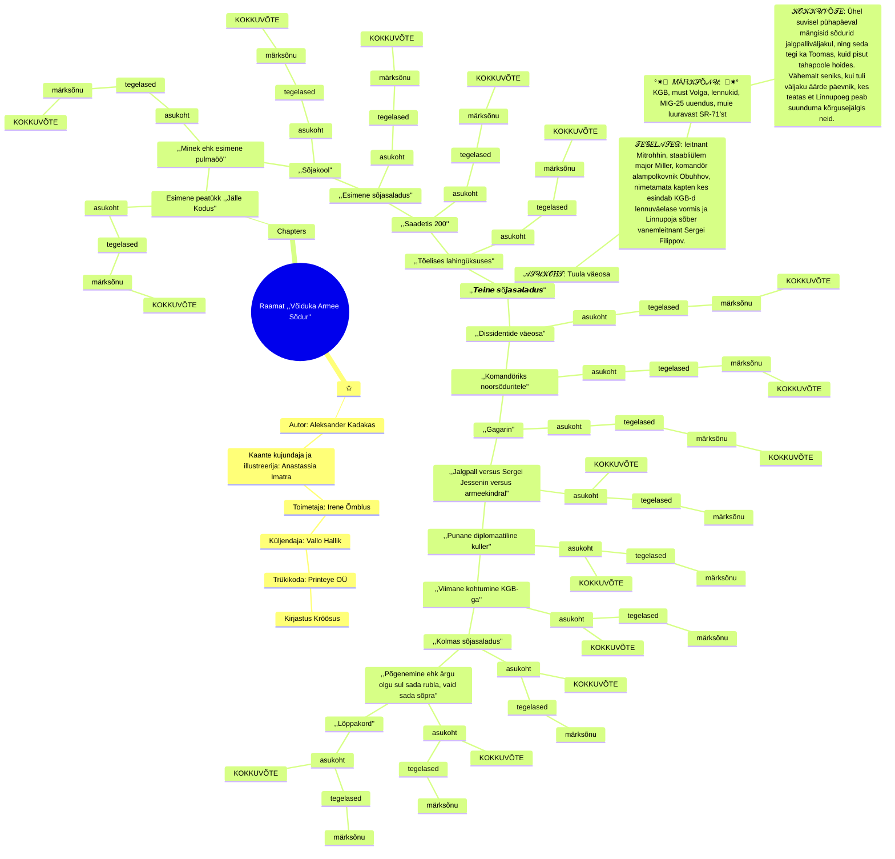
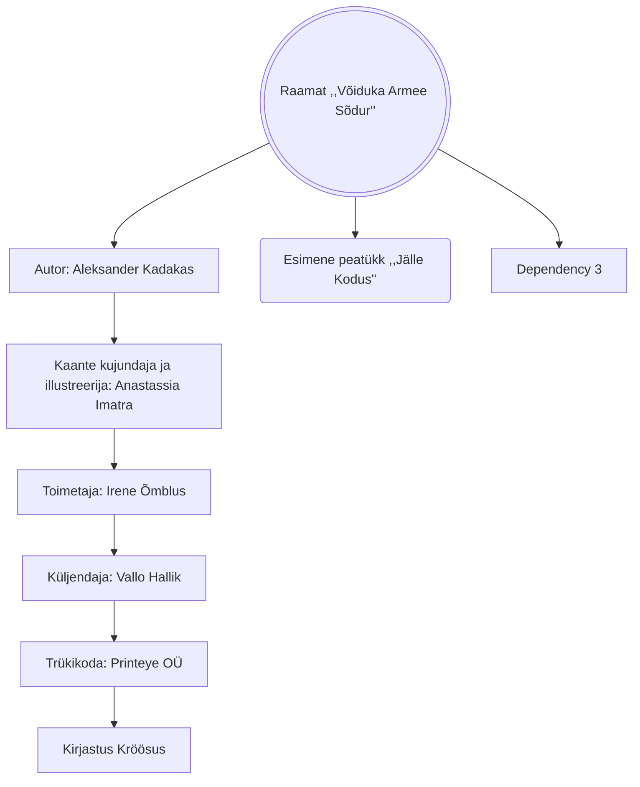

# Voiduka-Armee-Sodur
Võiduka Armee Sõdur - Raamatu dokumentatsioon paremini järje hoidmiseks.

```mermaid

mindmap
  root((Raamat ,,Võiduka Armee Sõdur''))
     ✩
      	Autor: Aleksander Kadakas
      	  Kaante kujundaja ja illustreerija: Anastassia Imatra
      	    Toimetaja: Irene Õmblus
      	      Küljendaja: Vallo Hallik
      	        Trükikoda: Printeye OÜ
      	          Kirjastus Kröösus


   		Chapters
   			Esimene peatükk ,,Jälle Kodus''
          	%%7
				    asukoht
					    tegelased
						    märksõnu
							    KOKKUVÕTE
   			  ,,Minek ehk esimene pulmaöö''
          	  %%10
				      asukoht
					        tegelased
						         märksõnu
							          KOKKUVÕTE
   		  	  ,,Sõjakool''
          	    %%21
				        asukoht
					          tegelased
						           märksõnu
							            KOKKUVÕTE
   		  	    ,,Esimene sõjasaladus''
          	      %%43
				          asukoht
					            tegelased
						             märksõnu
							              KOKKUVÕTE
   		  	      ,,Saadetis 200''
          	        %%48
				            asukoht
					              tegelased
						               märksõnu
							                KOKKUVÕTE
   		  	        ,,Tõelises lahingüksuses''
          	          %%67
				              asukoht
					                tegelased
						                 märksõnu
							                  KOKKUVÕTE
   		  	          ,,𝙏𝙚𝙞𝙣𝙚 𝙨õ𝙟𝙖𝙨𝙖𝙡𝙖𝙙𝙪𝙨''
          	            %%86
				                𝒜𝒮𝒰𝒦𝒪𝐻𝒯: Tuula väeosa
					                  𝒯𝐸𝒢𝐸𝐿𝒜𝒮𝐸𝒟: leitnant Mitrohhin, staabliülem major Miller, komandör alampolkovnik Obuhhov, nimetamata kapten kes esindab KGB-d lennuväelase vormis ja Linnupoja sõber vanemleitnant Sergei Filippov.
						                   °✷🎀  𝑀Ä𝑅𝒦𝒮Õ𝒩𝒰:  🎀✷° KGB, must Volga, lennukid, MIG-25 uuendus, muie luuravast SR-71'st
							                    𝒦𝒪𝒦𝒦𝒰𝒱Õ𝒯𝐸: Ühel suvisel pühapäeval mängisid sõdurid jalgpalliväljakul, ning seda tegi ka Toomas, kuid pisut tahapoole hoides. Vähemalt seniks, kui tuli väljaku äärde päevnik, kes teatas et Linnupoeg peab suunduma kõrgusejälgis neid. 

   		  	            ,,Dissidentide väeosa''
          	              %%94
				                  asukoht
					                    tegelased
						                     märksõnu
							                      KOKKUVÕTE
   		  	              ,,Komandöriks noorsõduritele''
          	                %%117
				                    asukoht
					                      tegelased
						                       märksõnu
							                        KOKKUVÕTE
   		  	                ,,Gagarin''
          	                  %%139
				                      asukoht
					                        tegelased
						                         märksõnu
							                          KOKKUVÕTE
   		  	                  ,,Jalgpall versus Sergei Jessenin versus armeekindral''
          	                    %%150
				                        asukoht
					                          tegelased
						                           märksõnu
							                        KOKKUVÕTE
   		  	                    ,,Punane diplomaatiline kuller''
          	                      %%196
				                          asukoht
					                            tegelased
						                             märksõnu
							                          KOKKUVÕTE
   		  	                    	,,Viimane kohtumine KGB-ga''
          	                     	 %%196
				                          	asukoht
					                            	tegelased
						                             	märksõnu
							                          	KOKKUVÕTE
   		  	                    		,,Kolmas sõjasaladus''
          	                     	 	%%211
				                          		asukoht
					                            		tegelased
						                             		märksõnu
							                          		KOKKUVÕTE
   		  	                    			,,Põgenemine ehk ärgu olgu sul sada rubla, vaid sada sõpra''
          	                     	 		%%219
				                          			asukoht
					                            			tegelased
						                             			märksõnu
							                          			KOKKUVÕTE
   		  	                    				,,Lõppakord''
          	                     	 			%%233
				                          				asukoht
					                            				tegelased
						                             				märksõnu
							                          				KOKKUVÕTE
```
	  

```mermaid
graph TD;

    %% Book Information
    A(((Raamat ,,Võiduka Armee Sõdur''))) --> B[ Autor: Aleksander Kadakas];
    B --> C[ Kaante kujundaja ja illustreerija: Anastassia Imatra];
    C --> D[ Toimetaja: Irene Õmblus];
    D --> E[ Küljendaja: Vallo Hallik];
    E --> F[ Trükikoda: Printeye OÜ];
    F --> G[ Kirjastus Kröösus];

    %% Chapters
    A --> H(Esimene peatükk ,,Jälle Kodus'');

    %% Other dependencies
    A --> I[Dependency 3];

```

Kasutatud materjalid, tööriistad ja allikad:
- https://lingojam.com/BoldTextGenerator
