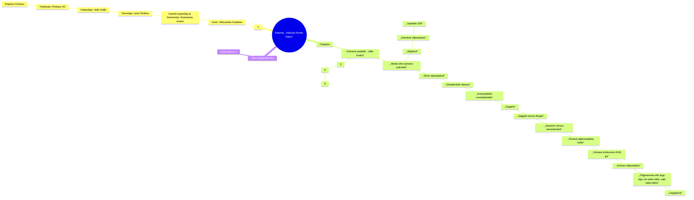
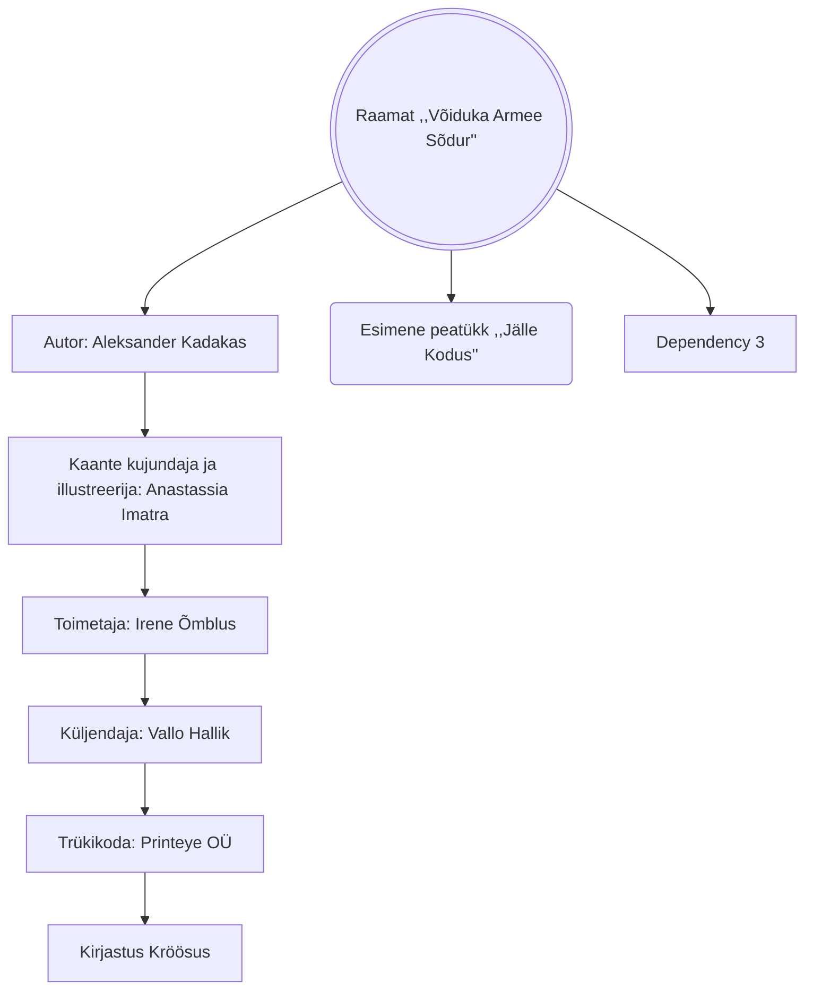

# Voiduka-Armee-Sodur
Võiduka Armee Sõdur - Raamatu dokumentatsioon paremini järje hoidmiseks.

```mermaid

mindmap
  root((Raamat ,,Võiduka Armee Sõdur''))
     ✩
      Autor: Aleksander Kadakas
        Kaante kujundaja ja illustreerija: Anastassia Imatra
          Toimetaja: Irene Õmblus
            Küljendaja: Vallo Hallik
              Trükikoda: Printeye OÜ
                Kirjastus Kröösus
    Chapters
      Esimene peatükk ,,Jälle Kodus''
        ,,Minek ehk esimene pulmaöö''
          ,,Sõjakool''
            ,,Esimene sõjasaladus''
              ,,Saadetis 200''
    					 ,,Teine sõjasaladud''
    					 	,,Dissidentide väeosa''
    					 		,,Komandöriks noorsõduritele''
    					 			,,Gagarin''
    					 				,,Jalgpall versus Sergei''
    					 					,,Jessenin versus armeekindral''
    					 						,,Punane diplomaatiline kuller''
    					 							,,Viimane kohtumine KGB-ga''
    					 								,,Kolmas sõjasaladus''
    					 									,,Põgenemine ehk ärgu olgu sul sada rubla, vaid sada sõpra''
    					 										,,Lõppakord''
        3
          4
            5
    Other dependencies
      Dependency 3


```

```mermaid
graph TD;

    %% Book Information
    A(((Raamat ,,Võiduka Armee Sõdur''))) --> B[ Autor: Aleksander Kadakas];
    B --> C[ Kaante kujundaja ja illustreerija: Anastassia Imatra];
    C --> D[ Toimetaja: Irene Õmblus];
    D --> E[ Küljendaja: Vallo Hallik];
    E --> F[ Trükikoda: Printeye OÜ];
    F --> G[ Kirjastus Kröösus];

    %% Chapters
    A --> H(Esimene peatükk ,,Jälle Kodus'');

    %% Other dependencies
    A --> I[Dependency 3];

```
