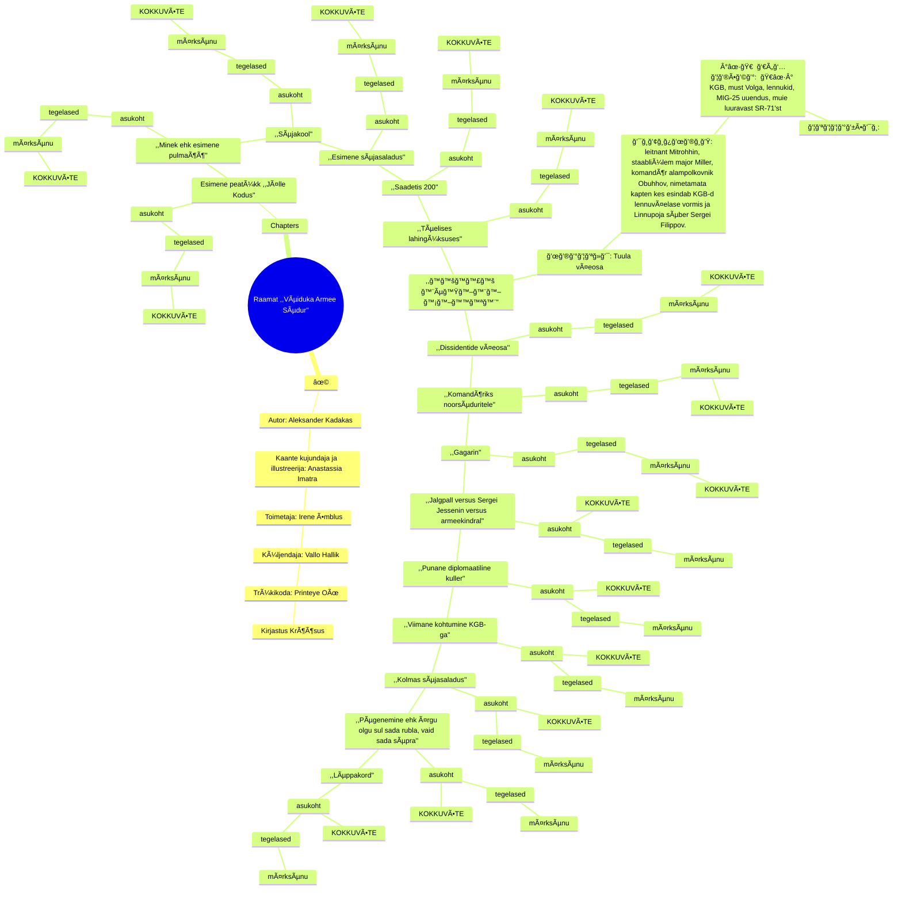
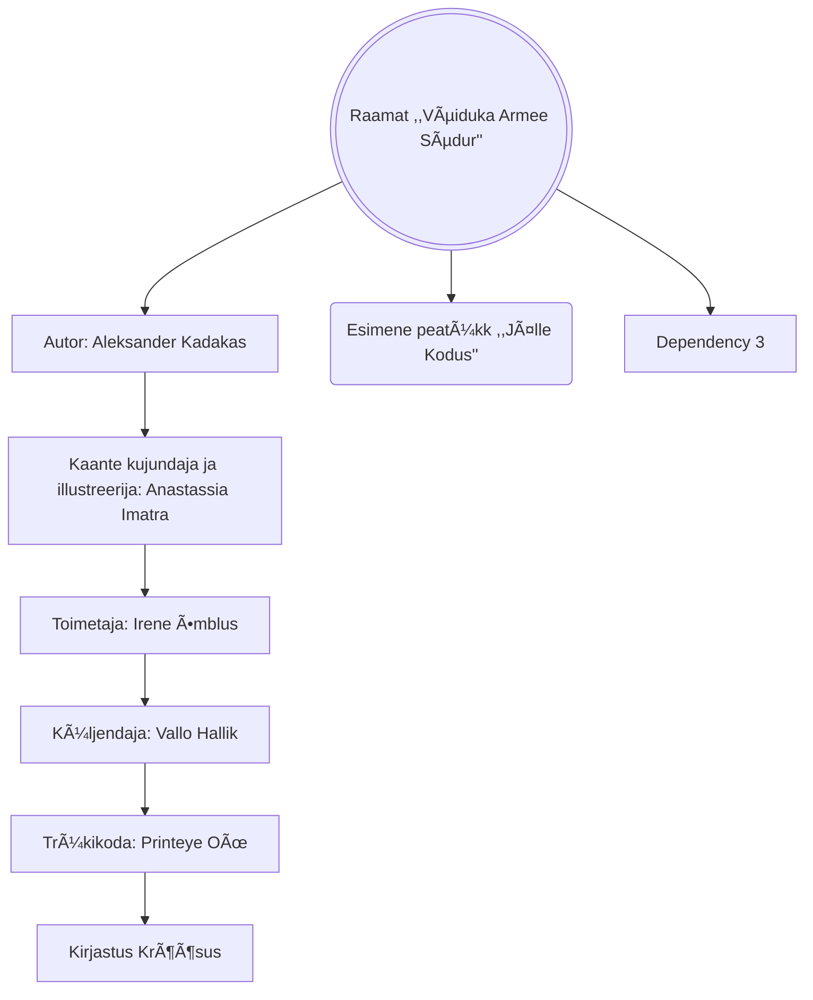

# Voiduka-Armee-Sodur
Võiduka Armee Sõdur - Raamatu dokumentatsioon paremini järje hoidmiseks.

```mermaid

mindmap
  root((Raamat ,,Võiduka Armee Sõdur''))
     ✩
      	Autor: Aleksander Kadakas
      	  Kaante kujundaja ja illustreerija: Anastassia Imatra
      	    Toimetaja: Irene Õmblus
      	      Küljendaja: Vallo Hallik
      	        Trükikoda: Printeye OÜ
      	          Kirjastus Kröösus


   		Chapters
   			Esimene peatükk ,,Jälle Kodus''
          	%%7
				    asukoht
					    tegelased
						    märksõnu
							    KOKKUVÕTE
   			  ,,Minek ehk esimene pulmaöö''
          	  %%10
				      asukoht
					        tegelased
						         märksõnu
							          KOKKUVÕTE
   		  	  ,,Sõjakool''
          	    %%21
				        asukoht
					          tegelased
						           märksõnu
							            KOKKUVÕTE
   		  	    ,,Esimene sõjasaladus''
          	      %%43
				          asukoht
					            tegelased
						             märksõnu
							              KOKKUVÕTE
   		  	      ,,Saadetis 200''
          	        %%48
				            asukoht
					              tegelased
						               märksõnu
							                KOKKUVÕTE
   		  	        ,,Tõelises lahingüksuses''
          	          %%67
				              asukoht
					                tegelased
						                 märksõnu
							                  KOKKUVÕTE
   		  	          ,,ğ™ğ™šğ™ğ™£ğ™š ğ™¨Ãµğ™Ÿğ™–ğ™¨ğ™–ğ™¡ğ™–ğ™™ğ™ªğ™¨''
          	            %%86
				                ğ’œğ’®ğ’°ğ’¦ğ’ªğ»ğ’¯: Tuula väeosa
					                  ğ’¯ğ¸ğ’¢ğ¸ğ¿ğ’œğ’®ğ¸ğ’Ÿ: leitnant Mitrohhin, staabliülem major Miller, komandör alampolkovnik Obuhhov, nimetamata kapten kes esindab KGB-d lennuväelase vormis ja Linnupoja sõber Sergei Filippov.
						                   °✷🀠 ğ‘€Ã„ğ‘…ğ’¦ğ’®Ã•ğ’©ğ’°:  ğŸ€âœ·Â° KGB, must Volga, lennukid, MIG-25 uuendus, muie luuravast SR-71'st
							                    ğ’¦ğ’ªğ’¦ğ’¦ğ’°ğ’±Ã•ğ’¯ğ¸:

   		  	            ,,Dissidentide väeosa''
          	              %%94
				                  asukoht
					                    tegelased
						                     märksõnu
							                      KOKKUVÕTE
   		  	              ,,Komandöriks noorsõduritele''
          	                %%117
				                    asukoht
					                      tegelased
						                       märksõnu
							                        KOKKUVÕTE
   		  	                ,,Gagarin''
          	                  %%139
				                      asukoht
					                        tegelased
						                         märksõnu
							                          KOKKUVÕTE
   		  	                  ,,Jalgpall versus Sergei Jessenin versus armeekindral''
          	                    %%150
				                        asukoht
					                          tegelased
						                           märksõnu
							                        KOKKUVÕTE
   		  	                    ,,Punane diplomaatiline kuller''
          	                      %%196
				                          asukoht
					                            tegelased
						                             märksõnu
							                          KOKKUVÕTE
   		  	                    	,,Viimane kohtumine KGB-ga''
          	                     	 %%196
				                          	asukoht
					                            	tegelased
						                             	märksõnu
							                          	KOKKUVÕTE
   		  	                    		,,Kolmas sõjasaladus''
          	                     	 	%%211
				                          		asukoht
					                            		tegelased
						                             		märksõnu
							                          		KOKKUVÕTE
   		  	                    			,,Põgenemine ehk ärgu olgu sul sada rubla, vaid sada sõpra''
          	                     	 		%%219
				                          			asukoht
					                            			tegelased
						                             			märksõnu
							                          			KOKKUVÕTE
   		  	                    				,,Lõppakord''
          	                     	 			%%233
				                          				asukoht
					                            				tegelased
						                             				märksõnu
							                          				KOKKUVÕTE
```
	  

```mermaid
graph TD;

    %% Book Information
    A(((Raamat ,,Võiduka Armee Sõdur''))) --> B[ Autor: Aleksander Kadakas];
    B --> C[ Kaante kujundaja ja illustreerija: Anastassia Imatra];
    C --> D[ Toimetaja: Irene Õmblus];
    D --> E[ Küljendaja: Vallo Hallik];
    E --> F[ Trükikoda: Printeye OÜ];
    F --> G[ Kirjastus Kröösus];

    %% Chapters
    A --> H(Esimene peatükk ,,Jälle Kodus'');

    %% Other dependencies
    A --> I[Dependency 3];

```
